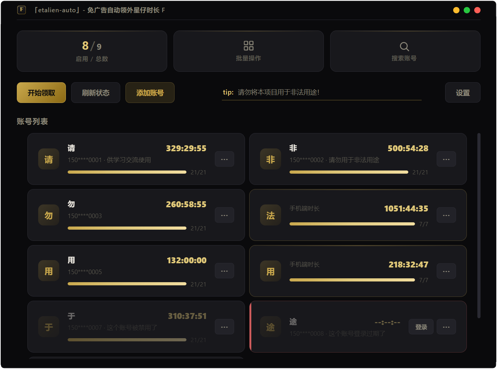

# etalien-auto

免广告自动领取外星仔加速时长工具。

## 环境要求

- Windows 10/11
- .NET Framework ≥ 4.6.2
- WebView2 Runtime ≥ 86.x（Win10/11 通常已自带）

## 软件截图



## 快速开始

### 方式一：直接使用打包版本

1. 前往 [Releases](https://github.com/JiangXu26710/etalien-auto/releases) 下载最新版本
2. 解压后运行 `etalien-auto.exe`

### 方式二：从源码运行

```bash
git clone https://github.com/JiangXu26710/etalien-auto.git
cd etalien-auto
python -m venv .venv
.venv\Scripts\activate
pip install -r requirements.txt
python gui/app.py
```

## 使用说明

### GUI 模式

运行程序后进入图形界面：

1. **添加账号** — 点击"添加账号"，输入手机号
2. **登录** — 支持两种方式：
	- **短信验证码**：点击"获取"，输入收到的短信验证码完成登录
	- **账号密码**：输入外星仔加速器的登录密码直接登录
3. **领取时长** — 点击"开始领取"，自动为所有已启用账号领取加速时长（电脑时长/手机时长）
4. **信息一览** — 主页中会显示各个账号卡片，展示账号的时长与领取进度。**单击可将卡片翻面**，以查看手机端的相关信息
5. **定时领取** — 在设置页开启"定时自动领取"，选择每天执行时间并保存。若配置了[Server酱](https://sct.ftqq.com/)的key，会将领取结果通知到微信
6. **账号搜索** — 输入关键字并回车，将在用户名、备注、手机号3个字段进行搜索。可以配合关键字“@启用”来筛选账号状态
7. **批量操作** — 可以对账号批量启用、禁用、删除

> 密码为可选配置。配置密码后，登录状态过期会自动用密码重新登录；不配置则需手动重新登录。可在编辑账号弹窗中修改密码。

### CLI 模式

适用于 Windows 计划任务或命令行环境：

```bash
# 打包后
etalien-auto.exe --cli                    # 领取时长后等待确认
etalien-auto.exe --cli --auto-close       # 领取时长后自动关闭

# 源码运行
python main.py
```

### 退出码

| 退出码 | 含义 |
|--------|------|
| 0 | 全部成功 |
| 1 | 部分成功 |
| 2 | 全部失败 |
| 3 | 有账号需要登录 |
| 4 | 无启用账号 |
| 5 | 网络/服务端错误 |
| 6 | 已有实例在运行（统一 Mutex 已存在） |
| 7 | 无数据库，需用户介入迁移（仅 GUI 能创建 db） |
| 8 | CLI 通知 GUI 触发领取后退出 |

### 从源码打包

```bash
pip install pyinstaller
python build.py
```

打包产物在 `dist/etalien-auto/` 目录下。

## 注意事项

所有数据都是明文存储，绝对不要将`./config/`中的任何内容分享给任何人。

虽然有为多账号做设计，但项目没有实际测试过在较多账号情况下的可用性、易用性。

cli模式为计划任务而设计，因此仅有领取时长的功能。
																								~ps:如果有需要，以后可能会拓展功能~

定时领取功能是通过添加windows计划任务实现，请保证电脑是开机已登录状态。此功能可能被杀毒软件拦截、误报。

**请不要将项目用于非法用途，本项目仅供学习交流使用。**

## 项目结构

```
etalien-auto/
├── core/                  # 核心业务层
│   ├── config.py          # 配置管理
│   ├── client.py          # API 客户端
│   ├── service.py         # 业务逻辑
│   ├── sign.py            # 请求签名
│   ├── notify.py          # Server酱通知
│   └── db.py              # 数据库存储层（SQLite 账号仓库）
├── gui/                   # GUI 层
│   ├── app.py             # 窗口入口
│   ├── api.py             # REST API
│   └── static/            # 前端资源
├── proto/                 # Protobuf 定义
│   ├── account.proto      # 账号相关消息
│   ├── apiv2.proto        # API v2 消息
│   └── error.proto        # 错误码定义
├── logo/                  # 图标资源
├── static/                # 项目截图等静态资源
│   └── screenshot/        # README 用截图
├── main.py                # CLI 入口
├── build.py               # 打包脚本
├── etalien-auto.spec      # PyInstaller 打包配置
├── account_pb2.py         # protobuf 生成（账号）
├── apiv2_pb2.py           # protobuf 生成（API v2）
├── error_pb2.py           # protobuf 生成（错误码）
├── docs/                  # 内部文档（.gitignore 排除）
├── test/                  # 单元测试（.gitignore 排除）
└── requirements.txt       # Python 依赖
```

## 技术栈

| 组件 | 技术 |
|------|------|
| 语言 | Python 3.11 |
| HTTP 客户端 | requests |
| 序列化 | protobuf |
| Web 框架 | Flask |
| 桌面窗口 | pywebview (WebView2) |
| 并发 | ThreadPoolExecutor |
| 数据存储 | SQLite (sqlite3 标准库) |
| 打包 | PyInstaller |

## 免责声明

本项目仅供学习交流使用，严禁用于商业用途。使用者需自行承担使用本工具所产生的一切风险和责任。本项目不对因使用本工具而导致的任何损失、账号封禁或其他后果负责。使用本工具即表示您已了解并同意自行承担相关风险。

## 许可证

[MIT](LICENSE)
